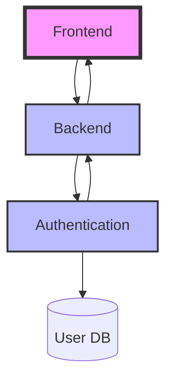

**Note:** This codebase was generated with [Cursor](https://www.cursor.so/).

# dummy_microservices_v2

## Overview

`dummy_microservices_v2` is a modular microservices application for displaying the current position of the International Space Station (ISS). The system is built with OOP and SOLID principles, and features:

- **Frontend:** React (TypeScript)
- **Backend:** FastAPI (Python)
- **Authentication:** Django (Python, JWT)
- **Database:** SQLite (for auth)
- **API Integration:** ISS position and geolocation via public APIs
- **Deployment:** Docker, Nginx, unit tests, and CI/CD ready

## Service Documentation

- [Frontend README](frontend/README.md)
- [Backend README](backend/README.md)
- [Auth README](auth/README.md)

## Architecture



- **Frontend**: Handles user registration, login, and displays ISS position (protected route).
- **Backend**: Provides `/iss` endpoint, validates JWT via Auth service, fetches ISS position and geolocation.
- **Auth**: Django service for registration, login, and JWT issuance/validation.
- **All services**: Communicate via REST APIs and are containerized with Docker and Nginx.

## Running the Application with Docker Compose

To run the entire stack (frontend, backend, and auth) using Docker Compose:

1. **Navigate to the project directory:**
   ```bash
   cd dummy_microservices_v2
   ```
2. **Build and start all services:**
   ```bash
   docker compose up --build
   ```
   (or use `docker-compose up --build` if your Docker version uses the old command)

3. **Access the services:**
   - Frontend: [http://localhost:3000](http://localhost:3000)
   - Backend: [http://localhost:8000](http://localhost:8000)
   - Auth: [http://localhost:8001](http://localhost:8001)

All services are networked together and ready for development or demo use.

## Services

### 1. Frontend (`frontend/`)
- React app (TypeScript)
- OOP/SOLID service classes for API and auth
- Registration, login, and ISS position display
- Unit tests (Jest, React Testing Library)
- Dockerfile and Nginx config for production

### 2. Backend (`backend/`)
- FastAPI app (Python)
- `/iss` endpoint (JWT-protected)
- OOP/SOLID service classes for ISS and Auth logic
- Unit tests (pytest, unittest.mock)
- Dockerfile and Nginx config for production

### 3. Auth (`auth/`)
- Django app (Python)
- Custom user model (email as username)
- Registration, login, JWT issuance/validation
- SQLite database
- Unit tests
- Dockerfile and Nginx config for production

## Development

- Each service has its own README with detailed setup, testing, and usage instructions.
- All business logic is in service classes; controllers are flat.
- All classes and functions are documented and covered by unit tests.
- Prompts and responses are logged in `docs/prompts` for traceability.

## Technical Details

- See `docs/technical.md` for business logic, technology stack, and future considerations.
- See `docs/architecture.mermaid` for a visual architecture diagram.

## License

MIT (or specify your license) 